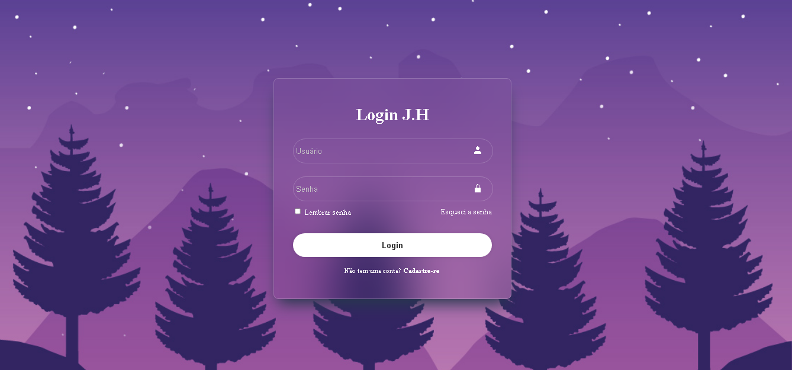

<h1 align="center">Tela de Login</h1>

  Interface de acesso ao usuario, feita com HTML, CSS e javaScript puro.  
  Projeto focado em responsividade, layout moderno e prática de front-end.

---

## 🖼 Visual do Projeto

  

---

## 🛠 Tecnologias utilizadas

 
  
  
  

---

## ✉ Contato

📬 Me mande um e-mail: *jean_henrique2@hotmail.com*

